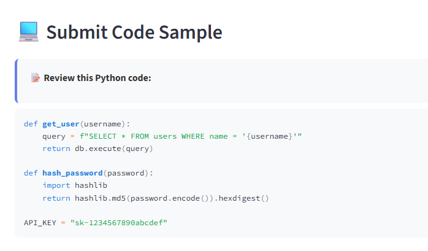
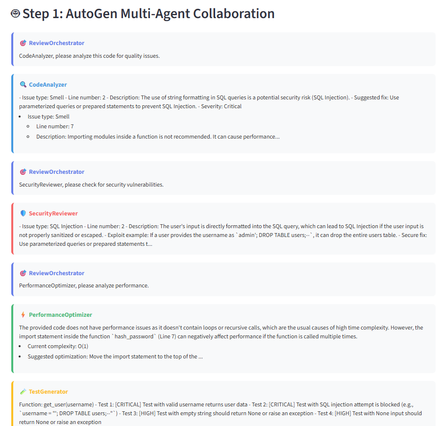
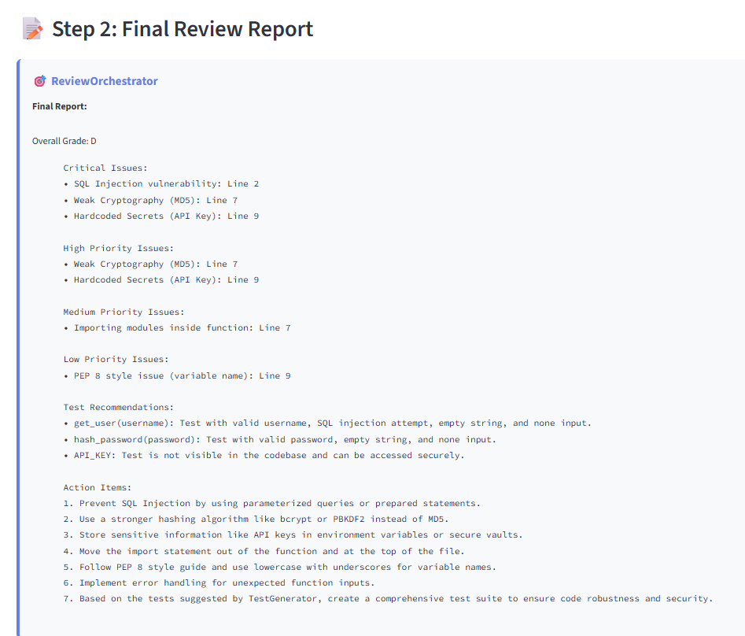
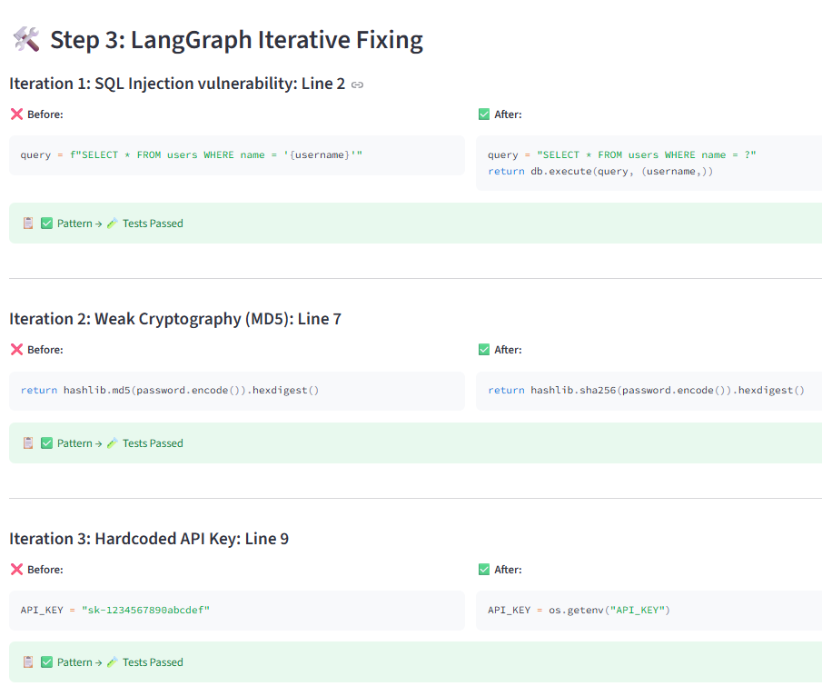

# Code Review Crew 🔍

> **Multi-Agent AI Code Review System with Autonomous Fixing**

An intelligent code review system that combines AutoGen's multi-agent collaboration with LangGraph's iterative fixing workflows. Get production-ready code reviews from specialized AI agents, then watch as issues are automatically fixed using a hybrid pattern-matching + LLM approach.

[](https://www.python.org/downloads/)
[](https://github.com/microsoft/autogen)
[](https://github.com/langchain-ai/langgraph)
[](https://streamlit.io/)

---

## 🌟 Features

### 🤖 Multi-Agent Code Review
- **6 Specialized AI Agents** work together to review your code
- **CodeAnalyzer** - Identifies code smells, anti-patterns, PEP 8 violations
- **SecurityReviewer** - Detects SQL injection, XSS, weak crypto, hardcoded secrets
- **PerformanceOptimizer** - Analyzes complexity, finds bottlenecks, suggests optimizations
- **TestGenerator** - Recommends comprehensive test cases
- **ReviewOrchestrator** - Coordinates the review workflow and synthesizes feedback
- **CodeExecutor** - Safely executes code in Docker sandbox for validation

### 🔥 Autonomous Code Fixing
- **Hybrid Fixing Approach**: Pattern-based fixes (fast, free) + LLM fallback (smart, adaptive)
- **Iterative Workflow**: Fixes issues one-by-one with testing after each change
- **LangGraph State Machine**: Transparent, debuggable fixing process
- **Real-time Progress**: See each iteration, pattern match, and fix applied

### 📊 Interactive Web Interface
- **Streamlit UI**: Clean, intuitive interface for code submission and results
- **Code Comparison View**: Side-by-side original vs. fixed code
- **Process Logs**: Full visibility into agent reasoning and fixing workflow
- **Conversation History**: See how agents collaborate and make decisions

---

## 🚀 Demo Flow

Below are screenshots showing the review and auto-fix process:

   

   

   

   

   

---

## 🚀 Quick Start

### Prerequisites
```bash
# Python 3.9 or higher
python --version

# OpenAI API key
export OPENAI_API_KEY="sk-..."
```

### Installation

```bash
# Clone the repository
git clone https://github.com/yourusername/code-review-crew.git
cd code-review-crew

# Create virtual environment
python -m venv venv
source venv/bin/activate  # On Windows: venv\Scripts\activate

# Install dependencies
pip install -r requirements.txt

# Set up environment variables
cp .env.example .env
# Edit .env and add your OPENAI_API_KEY
```

### Run the Application

```bash
# Start Streamlit app
streamlit run app.py
```

Navigate to `http://localhost:8501` in your browser.

---

## 📖 Usage

### Review Only Mode
Perfect for getting feedback without making changes:

```python
from unified_analyzer import UnifiedCodeAnalyzer

analyzer = UnifiedCodeAnalyzer()
results = analyzer.review_only(your_code)

# Results include:
# - Agent feedback
# - Issue severity rankings
# - Test recommendations
# - Action items
```

### Review + Auto-Fix Mode
Get reviews AND automatic fixes:

```python
analyzer = UnifiedCodeAnalyzer()
results = analyzer.review_and_fix(
    code=your_code,
    max_iterations=10
)

print(results['fixed_code'])
print(f"Fixed {results['issues_fixed']} issues")
```

### Example: Fixing Security Vulnerabilities

**Input Code:**
```python
def get_user(username):
    query = f"SELECT * FROM users WHERE name = '{username}'"
    return db.execute(query)

def hash_password(password):
    import hashlib
    return hashlib.md5(password.encode()).hexdigest()

API_KEY = "sk-1234567890abcdef"
```

**Issues Found:**
- ❌ SQL Injection vulnerability (Critical)
- ❌ Weak MD5 cryptography (Critical)
- ❌ Hardcoded API key (High)
- ❌ Import inside function (Medium)

**Fixed Code:**
```python
import hashlib
import os

# Fixed: SQL injection vulnerability
def get_user(username):
    query = "SELECT * FROM users WHERE name = ?"
    return db.execute(query, (username,))

# Fixed: Replaced MD5 with SHA256
def hash_password(password):
    return hashlib.sha256(password.encode()).hexdigest()

# Fixed: Moved secrets to environment variables
API_KEY = os.getenv("API_KEY")
```

---

## 🏗️ Architecture

The system uses a **two-stage pipeline**:

### Stage 1: AutoGen Multi-Agent Review
```
User Code → ReviewOrchestrator → CodeAnalyzer
                                → SecurityReviewer
                                → PerformanceOptimizer
                                → TestGenerator
                                → Final Report
```

### Stage 2: LangGraph Iterative Fixing
```
Issues → [Fix Issue → Test Code → Route] → Fixed Code
            ↑                         ↓
            └──────── Continue ────────┘
```

For detailed architecture, see [ARCHITECTURE.md](ARCHITECTURE.md).

---

## 🎯 Supported Issue Types

### Pattern-Based Fixes (Fast, Free, Deterministic)
✅ SQL Injection → Parameterized queries  
✅ Weak Crypto (MD5/SHA1) → SHA256  
✅ Hardcoded Secrets → Environment variables  
✅ Imports in Functions → Move to top  
✅ Nested Loops → Optimization suggestions  

### LLM-Based Fixes (Smart, Adaptive)
🤖 Race Conditions → Thread safety (locks, context managers)  
🤖 Memory Leaks → Data structure optimization  
🤖 Pickle Vulnerabilities → Safe serialization (JSON)  
🤖 Type Coercion Bugs → Proper type conversion  
🤖 Input Validation → Error handling and checks  
🤖 Division by Zero → Boundary condition handling  
🤖 PCI Compliance → Sensitive data masking  

---

## 🔧 Configuration

### Environment Variables
```bash
# Required
OPENAI_API_KEY=sk-...

# Optional
ANTHROPIC_API_KEY=...  # For Claude models
```

### LLM Configuration
```python
# In code_fixer/__init__.py
llm_config = {
    "model": "gpt-4",           # or "gpt-4-turbo", "gpt-3.5-turbo"
    "temperature": 0,           # 0 for deterministic, 0.7 for creative
    "api_key": os.getenv("OPENAI_API_KEY")
}
```

### Max Iterations
```python
# Higher = more thorough, but slower and more expensive
results = analyzer.review_and_fix(code, max_iterations=20)
```

---

## 📊 Performance

### Speed
- **Pattern-Based Fix**: ~0.1s per issue
- **LLM-Based Fix**: ~2-5s per issue
- **Full Review + Fix (10 issues)**: ~30-60s

### Cost (GPT-4)
- **Review Only**: ~$0.05-0.10 per review
- **Auto-Fix (pattern-based)**: $0 additional
- **Auto-Fix (LLM fallback)**: ~$0.01-0.03 per fix

### Accuracy
- **Pattern-Based Fixes**: 100% success rate for matched patterns
- **LLM-Based Fixes**: ~85% success rate on first attempt
- **Overall Fix Rate**: ~90% of issues fixed automatically

---

## 🧪 Testing

Run the test suite:
```bash
# Unit tests
pytest tests/

# Integration tests
pytest tests/integration/

# End-to-end tests
pytest tests/e2e/
```

Test with example code:
```bash
python -m code_review_crew.examples.test_all_examples
```

---

## 🛠️ Development

### Project Structure
```
code-review-crew/
├── app.py                          # Streamlit web interface
├── unified_analyzer.py             # Main orchestrator
├── log_capture.py                  # Console output capture
├── run_group_chat.py              # AutoGen group chat runner
├── code_review_crew/
│   ├── agents/                    # AutoGen agents
│   │   ├── base_agent.py
│   │   ├── code_analyzer.py
│   │   ├── security_reviewer.py
│   │   ├── performance_optimizer.py
│   │   ├── test_generator.py
│   │   └── orchestrator.py
│   ├── tools/                     # Analysis tools
│   │   ├── linting_tool.py
│   │   ├── complexity_analyzer.py
│   │   ├── security_scanner.py
│   │   └── test_runner.py
│   └── code_fixer/               # LangGraph fixer
│       ├── fixer.py              # Workflow orchestrator
│       ├── nodes.py              # Node functions
│       ├── state.py              # State definitions
│       └── conditions.py         # Routing logic
└── tests/                        # Test suite
```

### Adding New Pattern Fixes
```python
# In code_fixer/nodes.py

def _generate_fix(self, code: str, issue: Dict) -> str:
    description = issue.get('description', '').lower()
    
    # Add your pattern
    if 'your_pattern' in description:
        return self._fix_your_issue(code)
    
    # ... existing patterns ...
```

### Adding New Agents
```python
# Create new agent in code_review_crew/agents/
from .base_agent import BaseAgent

class YourAgent(BaseAgent):
    def __init__(self, llm_config: Dict, tools: Dict):
        # Initialize your agent
        
    def create_agent(self):
        # Return AutoGen agent
        
    def register_functions(self):
        # Register tool functions
```

---

## 🤝 Contributing

Contributions are welcome! Please follow these steps:

1. Fork the repository
2. Create a feature branch (`git checkout -b feature/amazing-feature`)
3. Commit your changes (`git commit -m 'Add amazing feature'`)
4. Push to the branch (`git push origin feature/amazing-feature`)
5. Open a Pull Request

### Development Guidelines
- Follow PEP 8 style guide
- Add tests for new features
- Update documentation
- Keep commits atomic and well-described

---

## 📝 License

This project is licensed under the MIT License - see the [LICENSE](LICENSE) file for details.

---

## 🙏 Acknowledgments

- **AutoGen** - Microsoft's multi-agent framework
- **LangGraph** - LangChain's state machine library
- **Streamlit** - Beautiful web interfaces for ML/AI apps
- **OpenAI** - GPT-4 for intelligent code analysis


---

## 🗺️ Roadmap

- [ ] Support for more programming languages (JavaScript, Java, C++)
- [ ] Integration with GitHub Actions for PR reviews
- [ ] VS Code extension
- [ ] Custom pattern definition UI
- [ ] Multi-file project analysis
- [ ] Code diff review (only review changed lines)
- [ ] Team collaboration features
- [ ] Configurable agent personas
- [ ] Performance benchmarking dashboard
